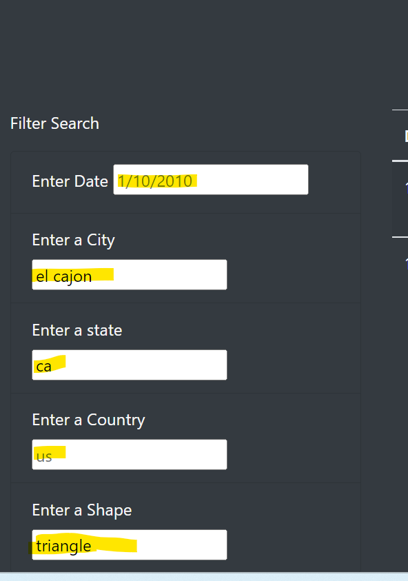
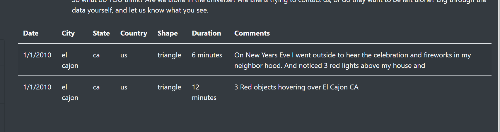

## Overview of project
   
  Previously, we have created a table to organize UFO data that is stored as a JavaScript array, or list. The table is fully dynamic and has the ability to filter data based on a certain date. Then we placed the table into an HTML file for easy viewing.
  This webpage and dynamic table are working as intended, but we'd like to provide a more in-depth analysis of UFO sightings by allowing users to filter for multiple criteria at the same time. The filters added to this table are city, state, country, and shape.

  
   -

## Results
   Let's see how we can use this webpage.  
   To use the search criteria:  
   - Enter the date, city, state, country and shape that you want to search and click enter: 

  
  

   - The results based on your criteria of choice will display on the website:  

  

## Summary
 - Drawbacks: 
  - It is not very user friendly. For examples, there's no filter or reset button to click on.
  - The data on the website is limited. 
 - Recommendations: 
   - Add a filer button 
   - Add a reset button to remove criteria for a new search
   - The colours on the website are too plain, better design could be implemented
